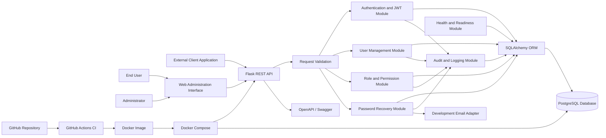

# Authentication and Role-Based Authorization Microservice

A standalone Flask microservice that manages user identity and controls access through roles and permissions.

This repository is the working project for **Group J - BSE2301 Software Engineering**. The formal proposal is available in [PROPOSAL.md](PROPOSAL.md).

## Project Question

> Design and implement an Authentication and Role-Based Authorization Microservice using Flask, with full DevOps tooling, containerization, and orchestration.

## What We Are Building

The service will provide a reusable REST API for:

- User registration and login
- Secure password hashing
- JWT access and refresh tokens
- Token refresh, revocation, and logout
- User profiles and account status
- Password changing and recovery
- Roles and permissions
- Permission-protected endpoints
- Administrative user management
- Security audit logs
- Health and readiness checks
- OpenAPI/Swagger documentation

The required release will remain focused. Social login, SMS authentication, enterprise Single Sign-On, Kubernetes, and complete client business systems are future improvements.

## Architecture

The Flask application is the single business microservice. PostgreSQL and the optional development email tool are supporting infrastructure. Docker Compose orchestrates their containers.

## System Modules

| Module | Responsibility |
|---|---|
| Application Core | Flask factory, configuration, blueprints, errors, and logging |
| User Management | Registration, profiles, search, pagination, and account status |
| Authentication | Login, JWT creation, refresh, logout, validation, and revocation |
| Authorization | Roles, permissions, assignments, and access checks |
| Password Recovery | Reset requests, expiring tokens, and password replacement |
| Audit and Monitoring | Security events, application logs, health, and readiness |
| Administration UI | Simple demonstration client for users, roles, and audit records |
| Testing and Documentation | Pytest suite, OpenAPI/Swagger, and API examples |
| DevOps and Deployment | Docker, Compose, GitHub Actions, configuration, and releases |

## Planned API

### Authentication

| Method | Endpoint | Purpose |
|---|---|---|
| POST | `/api/v1/auth/register` | Register a user |
| POST | `/api/v1/auth/login` | Authenticate and issue tokens |
| POST | `/api/v1/auth/refresh` | Issue a new access token |
| POST | `/api/v1/auth/logout` | Revoke the current token |
| POST | `/api/v1/auth/password/forgot` | Request a password reset |
| POST | `/api/v1/auth/password/reset` | Reset a password with a valid token |

### Current user

| Method | Endpoint | Purpose |
|---|---|---|
| GET | `/api/v1/users/me` | View the current profile |
| PATCH | `/api/v1/users/me` | Update the current profile |
| POST | `/api/v1/users/me/password` | Change the current password |
| GET | `/api/v1/users/me/roles` | View assigned roles |

### Administration and RBAC

| Method | Endpoint | Purpose |
|---|---|---|
| GET | `/api/v1/users` | List and search users |
| GET | `/api/v1/users/{id}` | View a user |
| PATCH | `/api/v1/users/{id}/status` | Activate or suspend a user |
| POST | `/api/v1/users/{id}/roles` | Assign a role |
| DELETE | `/api/v1/users/{id}/roles/{role_id}` | Remove a role |
| GET/POST | `/api/v1/roles` | List or create roles |
| PATCH/DELETE | `/api/v1/roles/{id}` | Update or delete a role |
| GET/POST | `/api/v1/permissions` | List or create permissions |
| POST | `/api/v1/roles/{id}/permissions` | Assign a permission to a role |
| DELETE | `/api/v1/roles/{id}/permissions/{permission_id}` | Remove a permission |
| GET | `/api/v1/audit-logs` | View authorized audit records |

### Operations

| Method | Endpoint | Purpose |
|---|---|---|
| GET | `/health/live` | Confirm that Flask is running |
| GET | `/health/ready` | Confirm that dependencies are ready |
| GET | `/docs` | Open interactive API documentation |

## Preliminary Database Design

The database design will be finalized as its own project subgoal. The initial tables are:

- `users`: identity, password hash, profile, and account status
- `roles`: role names and descriptions
- `permissions`: individual access rights
- `user_roles`: many-to-many user and role assignments
- `role_permissions`: many-to-many role and permission assignments
- `revoked_tokens`: revoked JWT identifiers and expiry information
- `password_reset_tokens`: hashed, limited-duration reset-token records
- `audit_logs`: important security events and outcomes

Raw passwords and raw access, refresh, or reset tokens must never be stored.

## Technology Stack

| Area | Choice |
|---|---|
| Language and framework | Python and Flask |
| Database | PostgreSQL |
| ORM and migrations | SQLAlchemy and Flask-Migrate/Alembic |
| Tokens | Flask-JWT-Extended |
| Validation | Marshmallow or Pydantic |
| Documentation | OpenAPI/Swagger |
| Testing | Pytest and pytest-cov |
| Code quality | Ruff and Black |
| Containers | Docker and Docker Compose |
| Automation | GitHub Actions |
| Collaboration | Git and GitHub |

## Team Roles

Roles show primary ownership, but every member must write code, tests, and documentation and must review another member's work.

### Mukisa Ben Ezra — Team Lead, Platform and DevOps Engineer

- Establish the Flask structure and shared configuration & initial PostgreSQL connection
- Implement shared errors, responses, and blueprint integration
- Configure Docker, Docker Compose, GitHub Actions, and project integration
- Review pull requests and coordinate integration
- Coordinate milestones and the GitHub issue board

### Abigaba Patience Sarah — Database and User Management Engineer

- Design PostgreSQL tables and SQLAlchemy models
- Create migrations and seed data
- Implement registration, profiles, account status, search, and pagination
- Test database and user-management behaviour

### Gihozo Patrick — Authentication Engineer

- Implement password hashing and login
- Implement access tokens, refresh tokens, logout, and revocation
- Protect authenticated endpoints and manage the token lifecycle
- Test authentication and token lifecycle(valid, invalid, expired & revoked) and security failure cases

### Kristiana B. Sengonzi — Authorization and Administration Engineer

- Implement roles, permissions, and assignments
- Implement access-control decorators or middleware
- Build the simple administration interface
- Test allowed and denied access scenarios

### Aber Mercy — Security Support, Testing and Documentation Engineer

- Implement password recovery, account management, audit logging, and health checks
- Verify secure handling of sensitive information
- Coordinate automated test configuration and coverage
- Maintain OpenAPI documentation and deployment instructions

## GitHub Workflow

1. Select or create a GitHub issue.
2. Assign the issue to one member.
3. Create a small feature branch from the latest `develop`.
4. Implement the feature and its tests.
5. Run all local checks.
6. Push the branch and open a pull request linked to the issue.
7. Wait for continuous-integration checks.
8. Obtain at least one peer review.
9. Correct problems and merge into `develop`.
10. Test the integrated application before promoting a milestone to `main`.

Suggested branches include `feature/database-models`, `feature/user-management`, `feature/jwt-authentication`, `feature/rbac`, `feature/password-recovery`, `feature/audit-logging`, `feature/docker`, and `feature/ci-testing`.

## 10 days Roadmap

### Days 1 : Foundation

- [ ] Confirm scope and proposal
- [ ] Create GitHub issues and assign work
- [ ] Create the Flask project skeleton
- [ ] Connect PostgreSQL
- [ ] Add a health endpoint and setup documentation

**Gate:** Every member can clone and start the same Flask and PostgreSQL environment.

### Days 2 : Database and Users

- [ ] Finalize initial database relationships
- [ ] Implement models and migrations
- [ ] Add safe seed roles and permissions
- [ ] Implement registration and profiles
- [ ] Add validation and tests

**Gate:** A fresh database can be migrated, a user can register, duplicates are rejected, and passwords are hashed.

### Days 3-4 : Authentication

- [ ] Implement login
- [ ] Issue access and refresh tokens
- [ ] Protect a demonstration endpoint
- [ ] Implement refresh, logout, and revocation
- [ ] Test invalid, expired, and revoked tokens

**Gate:** The complete login-to-logout lifecycle works and passes automated tests.

### Days 5-6 : Authorization

- [ ] Implement role and permission operations
- [ ] Assign roles to users
- [ ] Enforce permissions on protected endpoints
- [ ] Add administrator user controls
- [ ] Add authorization tests

**Gate:** Access changes correctly when roles or permissions are assigned or removed.

### Days 7-8 : Security Support

- [ ] Implement password changing and recovery
- [ ] Implement account activation and suspension
- [ ] Record audit events
- [ ] Add liveness and readiness checks
- [ ] Verify that sensitive information is not logged

**Gate:** Reset tokens expire and cannot be reused; important events appear in the audit log.

### Days 9 : DevOps and Integration

- [ ] Finalize Dockerfile and Docker Compose
- [ ] Configure format, lint, test, migration, and image-build checks
- [ ] Complete GitHub Actions
- [ ] Complete Swagger documentation
- [ ] Test from a clean checkout

**Gate:** CI passes and the complete environment starts using the documented Compose process.

### Days 10 : Submission and Presentation

- [ ] Run final acceptance tests
- [ ] Capture annotated screenshots
- [ ] Complete report and presentation slides
- [ ] Document individual contributions
- [ ] Rehearse a live demonstration
- [ ] Tag the final GitHub release
- [ ] Prepare backup screenshots or a recording

**Gate:** Another person can access, run, understand, and evaluate the project.

## Subgoal Completion Rule

A feature is complete only when:

- Its acceptance conditions are satisfied
- Its code is committed through a feature branch
- Relevant automated tests pass
- Its API behaviour is documented
- No secret or sensitive value is committed
- At least one teammate has reviewed it
- It works after integration into `develop`

## Final Acceptance Checklist

- [ ] Registration securely stores a new user
- [ ] Login issues valid access and refresh tokens
- [ ] Protected endpoints reject missing or invalid tokens
- [ ] Expired and revoked tokens are rejected
- [ ] Logout revokes the appropriate token
- [ ] Roles and permissions control access correctly
- [ ] Ordinary users cannot use administrative endpoints
- [ ] Suspended users cannot log in
- [ ] Password reset tokens expire and cannot be reused
- [ ] Important events are recorded without sensitive values
- [ ] PostgreSQL schema is reproducible using migrations
- [ ] API documentation covers all public endpoints
- [ ] Automated tests and code-quality checks pass
- [ ] Docker image builds successfully
- [ ] Docker Compose starts the complete environment
- [ ] GitHub Actions passes on the final release
- [ ] The team can demonstrate the project from a clean setup
