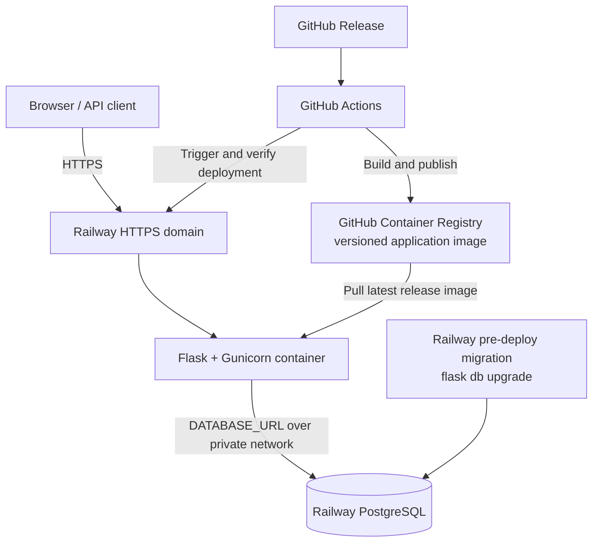
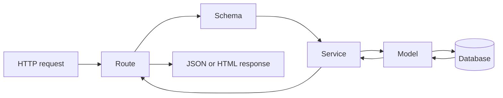
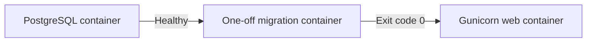
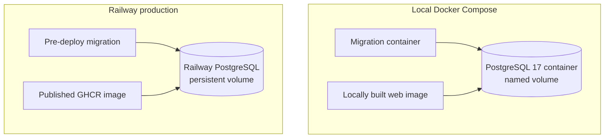

# Architecture

## System overview

The application and database are separate deployable services. The published
image contains the Flask code, runtime dependencies, Gunicorn, CLI commands,
and Alembic migrations. It does not contain PostgreSQL, application data,
administrator credentials, or environment secrets.

## Application factory

`app/create_app()` creates each Flask application instance. It:

1. Loads the selected configuration class.
2. Initializes SQLAlchemy, Flask-Migrate, and Flask-JWT-Extended.
3. Imports the shared models for migration discovery.
4. Registers Authentication, Authorization, Users, Health, and UI blueprints.
5. Registers `flask seed-db`.
6. Registers the JWT blocklist callback.

`run.py` only creates and starts the application.

## Request flow

Feature code follows:

- `routes.py` handles HTTP input and response status codes.
- `schemas.py` validates and normalizes request data.
- `services.py` owns business rules and database transactions.
- `app/models/` contains shared SQLAlchemy models.
- `app/extensions.py` contains shared extension instances.

## Modules

| Module | Current responsibility |
|---|---|
| `app/modules/authentication/` | Registration orchestration, password hashing and verification, JWT lifecycle, logout, and revocation |
| `app/modules/users/` | User creation, profile retrieval/update, search, and pagination |
| `app/modules/authorization/` | Roles, permissions, assignments, and permission enforcement |
| `app/modules/security/` | Password changes, password-reset lifecycle, and permission-protected account suspension |
| `app/health/` | Liveness endpoint |
| `app/cli/` | Interactive RBAC and bootstrap-Admin seeding |
| `app/modules/security/audit.py` | Shared security and authentication audit-event recording |
| `app/ui.py` | Login, registration, and role-dashboard page routes |
| `app/templates/` | Server-rendered page shells |
| `app/static/` | Browser-side session and dashboard behavior |

## Frontend token handling

The browser stores access and refresh tokens in `sessionStorage`. API calls send
the access token in the `Authorization` header. When an access token expires,
the shared session helper attempts one refresh-token exchange and retries the
request. Logout revokes the shared session and clears both browser tokens.

The dashboards resolve the current role through `/api/v1/auth/me` and redirect
to the matching role page. Users can update their profile from their account
view. Admin UI controls call permission-protected APIs for account suspension,
reactivation, and audit activity. Public recovery pages request a reset and
accept the token from a Gmail SMTP-delivered reset link. Only a digest of the
one-time token is stored in the database.

## Local Compose startup

Docker Compose separates schema migration from HTTP serving:

The migration service and web service use the same locally built application
image and environment. The web service starts only when `flask db upgrade`
exits successfully. Interactive administrator seeding remains a separate
command.

## Runtime comparison

Compose orchestrates the complete local environment. Railway performs the
production orchestration through separately configured application and
PostgreSQL services; it does not run `compose.yaml`.

## Configuration

`app/config.py` reads runtime settings from environment variables.
`TestConfig` replaces PostgreSQL with a fresh in-memory SQLite database and uses
a test-only JWT secret.
